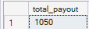
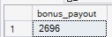
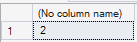
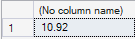

# 🚗 Uber Driver Bonus Scheme Analysis

### 🚀 Executive Summary
**Goal:** Decide which of two driver bonus structures gets more cars on the road for a high-demand Saturday, at the lower cost.  
**Role:** Data Analyst.  
**Tools:** SQL (filtering, conditional aggregation, subqueries, type casting).

**Answer in one line:** Option 1 costs **$1,050** against Option 2's **$2,696** — 2.6x the spend — and only **2 drivers** clear Option 1's bar without clearing Option 2's. Option 1 is the cost-effective scheme.

---

## 📖 The Story
Demand is forecast to spike on an upcoming Saturday and Uber needs significantly more drivers online than the previous week. Two incentive schemes are on the table, and they reward completely different behaviour: one pays a flat sum for meeting a quality bar, the other pays per trip for volume.

Operations needed to know the cost of each, and who each one leaves out.

**Option 1 — flat $50** per driver who, in the time frame:
* works at least **8 supply hours**
* accepts at least **90%** of requests
* completes at least **10 trips**
* holds a rating of **4.7 or better**

**Option 2 — $4 per completed trip** for every driver who:
* completes at least **12 trips**
* holds a rating of **4.7 or better**

---

## 🔍 Key Questions & Results

### 1. What does Option 1 cost?
* **The Approach:** Counted drivers clearing all four conditions and multiplied by the $50 flat rate.
* **Result:** **$1,050** — 21 qualifying drivers at $50 each.

### 2. What does Option 2 cost?
* **The Approach:** Summed `trips_completed * 4` across drivers meeting the trip and rating thresholds — the payout scales with volume rather than headcount.
* **Result:** **$2,696**, which is 674 qualifying trips at $4 each.

### 3. Who wins under Option 1 but loses under Option 2?
* **The Approach:** Isolated drivers completing 10 or 11 trips who met the acceptance, hours and rating bars — the group that clears the quality bar but not the volume bar.
* **Result:** **2 drivers**.

* **Why it matters:** This was the main fairness objection to Option 2 — drivers doing everything asked of them on quality, then missing out on volume. At 2 drivers it is not a material concern, and it should not drive the decision.

### 4. How many drivers are high-rated but low-engagement?
* **The Approach:** Calculated the share of drivers completing fewer than 10 trips *and* accepting under 90% of requests while still holding a 4.7+ rating, using explicit `CAST` to `FLOAT` so integer division didn't silently zero the result.
* **Result:** **10.92%** of drivers online.

* **Why it matters:** Roughly one driver in nine is well-rated but barely working. Neither scheme reaches them — Option 1 requires 8 hours and 90% acceptance, Option 2 requires 12 trips, and this group clears none of those. They are the largest pool of latent supply on the platform and the most obvious gap in both designs.

---

## ✅ Findings & Recommendation

| | Option 1 (flat $50) | Option 2 ($4/trip) |
|---|---|---|
| **Total payout** | $1,050 | $2,696 |
| **Qualifying drivers** | 21 | not measured |
| **Cost per driver** | $50 (fixed) | varies with trips completed |
| **Rewards** | Quality + availability | Raw trip volume |
| **Excludes** | High-volume drivers with low acceptance | 2 quality drivers at 10–11 trips |

**Recommendation: Option 1.** It costs $1,646 less — under 40% of Option 2's spend — and the fairness objection that would have counted against it turns out to affect only 2 drivers.

The cost gap is not the whole case, though. Option 2 attaches no condition to acceptance rate or supply hours, and pays per trip to drivers who are already completing 12 or more. A large share of that $2,696 therefore rewards behaviour that would have happened without the bonus. Option 1's four conditions are all things the business actually wants changed on a surge day — hours online, requests accepted, trips completed, service maintained.

**The trade-off in one line:** Option 1 buys *reliability* — it pays for acceptance rate and hours online, which is what keeps riders from waiting. Option 2 buys *throughput* — it pays for completed trips regardless of how many requests were declined to get there. On a surge Saturday, the constraint is cars on the road, which is what Option 1 prices.

**The bigger opportunity is neither scheme.** 10.92% of drivers are well-rated and under-engaged. Converting a fraction of that group would add more supply than either bonus buys, and no version of these two designs is aimed at them.

---

## 🛠️ Technical Skills Demonstrated
* **Multi-condition filtering:** Compound `WHERE` clauses translating business rules directly into logic.
* **Conditional aggregation:** `COUNT` and `SUM` over filtered populations to price each scheme.
* **Type casting:** Explicit `CAST(... AS FLOAT)` to avoid integer division returning 0 — a silent failure that would have made the percentage look correct and be wrong.
* **Subqueries:** Nested aggregate over a filtered subset divided by the full population to produce a share.

---

## 🗂️ Dataset Schema
Queries run against `uber_dataset`:

| Column | Description |
|---|---|
| `Driver_ID` | Unique identifier for each driver |
| `Supply_Hours` | Total hours the driver was online |
| `Trips_Completed` | Number of successfully finished trips |
| `Acceptance_percentage` | Percentage of trip requests accepted |
| `Rating` | The driver's average rating |

---

## ▶️ Reproducing
1. Unzip `uber_dataset.zip` and load the driver data into your SQL environment as a table named `uber_dataset`.
2. Run `Uber Partner Business Modeling.sql` top to bottom — each query is preceded by the question it answers.

The four PNGs in the repository are the result sets for those queries, in the same order.

---

## 📊 Future Improvements
* **Model a hybrid:** A smaller flat bonus at 10 trips plus a per-trip rate above 12 would cover both groups. Worth pricing.
* **Sensitivity analysis:** Vary the trip threshold from 8 to 15 and plot payout against drivers reached to find the efficient point.
* **Target the 10.92%:** Price a re-engagement incentive aimed at high-rated, low-activity drivers and compare its cost per additional car on the road against both options here.
* **Estimate the behavioural response:** Cost is only half the decision — the scheme that pays less but converts fewer drivers isn't the cheaper one.

---

### 👋 About Me
Data Analyst based in **Manchester, UK**, working in **SQL, Excel, Tableau and Power BI**.
[LinkedIn](https://www.linkedin.com/in/ibomeno-basiekanem/) · [Portfolio](https://thelordbass.github.io/)
